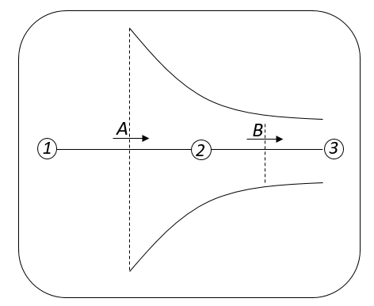
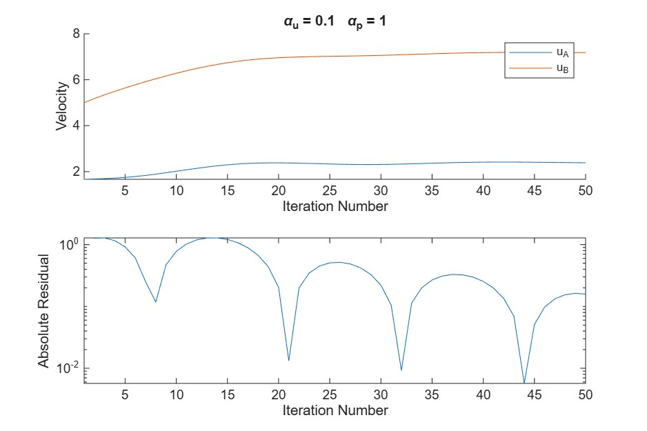
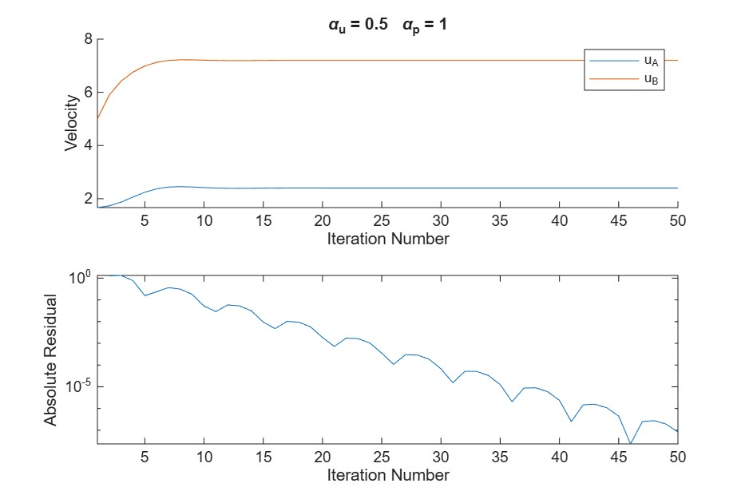
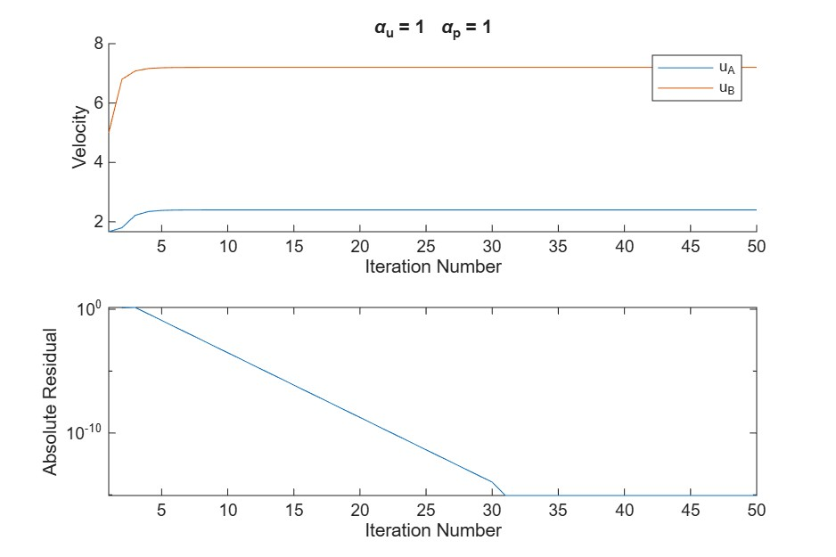
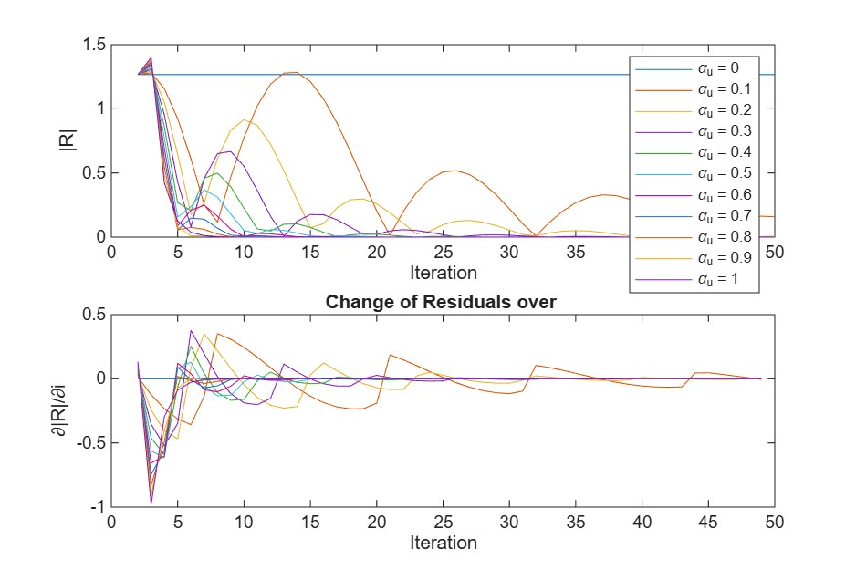
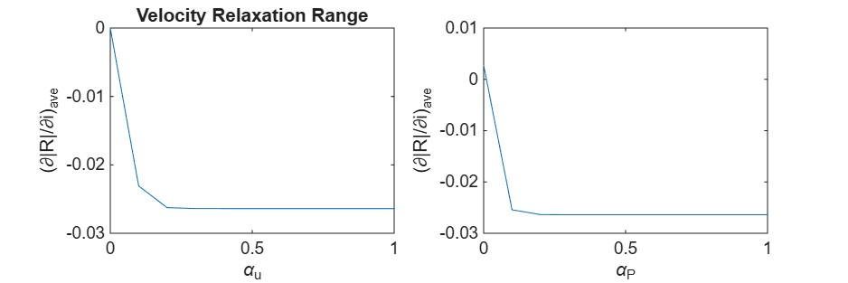
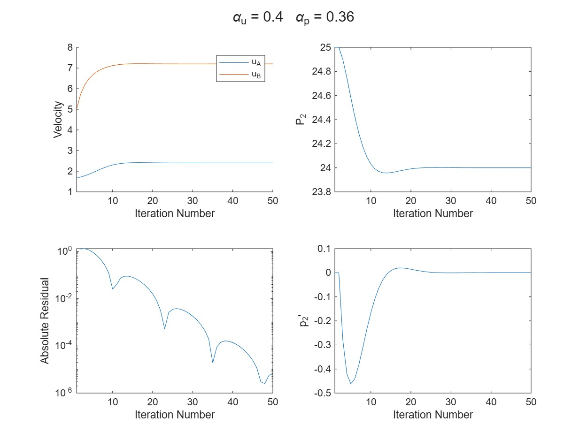

# One Dimensional Compressible Nozzle Flow Solver

This project is a MATLAB computational fluid dynamics solver for simulating one dimensional compressible flow through a nozzle. The program models how flow properties change along a variable area nozzle and demonstrates the numerical behavior of accelerating flow in a propulsion relevant geometry.

The solver uses a predictor corrector time marching method to advance the governing equations and evaluate the evolution of flow properties through the nozzle. The project was developed to connect compressible flow theory with practical CFD implementation, with emphasis on conservation form equations, numerical stability, convergence behavior, and nozzle flow physics.

## Project Objective

The objective of this project was to build a numerical solver capable of modeling one dimensional compressible flow through a nozzle with changing cross sectional area. The program tracks the behavior of flow variables along the nozzle and captures the acceleration of the flow as the area varies.

This type of problem is relevant to propulsion, gas dynamics, and aerospace CFD because nozzles are used to convert thermal and pressure energy into directed kinetic energy. Even in one dimension, nozzle flow provides a useful test case for understanding compressibility, conservation laws, numerical marching schemes, and the connection between analytical gas dynamics and computational simulation.

## Methodology

The nozzle flow field was discretized along a one dimensional grid. Flow properties were calculated at each grid location and advanced using a predictor corrector approach. This method estimates the next state of the solution with a predictor step, then refines that estimate with a corrector step.

The solver tracks the development of the flow field over time and evaluates how the nozzle geometry affects the local flow solution. By formulating the equations in conservation form, the program emphasizes physically meaningful transport of mass, momentum, and energy through the domain.

This cross section is included to define the nozzle geometry used by the solver. The changing area of the nozzle drives the acceleration of the flow and provides the physical basis for evaluating how velocity, pressure, and residual behavior respond to the geometry.

## Governing Correction Equations

The numerical method uses pressure and velocity correction equations to enforce continuity between internal nodes and iteratively reduce flow rate error. The pressure correction is determined by setting continuity at the internal node:

$$
{p_2}' = \frac{F\left(A_A u_A^\ast - A_B u_B^\ast\right)}{A_A^2 + A_B^2}
$$

The corrected pressure at point 2 is then updated using:

$$
p_2 = p_2^\ast + {p_2}'
$$

The velocity correction at point A is calculated from the pressure correction between points 1 and 2:

$$
u_A' = \frac{A_A}{F_A}\left(p_1' - p_2'\right)
$$

The velocity correction at point B is calculated from the pressure correction between points 2 and 3, with the correction at point A carried forward:

$$
u_B' = \frac{A_B}{F_B}\left(p_2' - p_3'\right) + u_A'
$$

The predicted flow rate at point A is calculated as:

$$
F_A = A_A^2 \frac{p_1 - p_2^\ast}{F}
$$

The updated flow rate at point B is calculated as:

$$
F_B = A_B u_A^\ast + A_B^2 \frac{\left(p_2^\ast - p_3\right)}{F}
$$

The residual is used to measure the difference between the predicted and updated flow rates:

$$
R = |F_A - F_B|
$$

This residual provides a numerical measure of continuity error. As the solution converges, the residual should decrease, indicating that the corrected pressure and velocity values are producing more consistent flow behavior across the nozzle.

## Assumptions

The solver is based on the following simplifying assumptions:

* One dimensional flow
* Compressible flow behavior
* Variable area nozzle geometry
* Time marching numerical solution
* Flow properties vary along the nozzle axis

These assumptions reduce the problem to a manageable CFD implementation while preserving the core physics needed to study nozzle acceleration and compressible flow behavior.

## Outputs

The program produces numerical and visual outputs used to evaluate solver behavior and flow development. These outputs include relaxation behavior, residual trends, and convergence of the calculated flow variables.

### Relaxation Parameter Study

This plot is included to show solver behavior at a low relaxation parameter. A small relaxation value applies conservative updates between iterations, which can improve numerical stability but may slow convergence. This output helps demonstrate how cautious correction steps affect the velocity and pressure residual history.

This plot is included to show solver behavior at a moderate relaxation parameter. Comparing this case against lower and higher relaxation values helps identify whether the solver can converge more efficiently while still avoiding unstable oscillations or divergence.

This plot is included to show solver behavior when the full correction is applied at each iteration. It provides a useful comparison against under relaxed cases and helps evaluate whether the numerical method remains stable when pressure and velocity corrections are applied without damping.

### Residual Sensitivity

This plot is included to evaluate how the residual changes as the relaxation parameter changes. The derivative of the residual provides insight into convergence sensitivity and helps identify whether larger relaxation parameters produce a more consistent decrease in error.

This plot is included to compare residual behavior across a broader range of relaxation parameters. It supports selection of a relaxation value by showing which values reduce residuals effectively and which values may lead to slower convergence or less stable numerical behavior.

### Convergence Behavior

This plot is included to show the calculated values approaching their final converged values. It demonstrates that the iterative correction process is moving toward a stable solution and provides evidence that the predictor corrector method is producing consistent flow results.
# One Dimensional Compressible Nozzle Flow Solver

This project is a MATLAB computational fluid dynamics solver for simulating one dimensional compressible flow through a nozzle. The program models how flow properties change along a variable area nozzle and demonstrates the numerical behavior of accelerating flow in a propulsion relevant geometry.

The solver uses a predictor corrector time marching method to advance the governing equations and evaluate the evolution of flow properties through the nozzle. The project was developed to connect compressible flow theory with practical CFD implementation, with emphasis on conservation form equations, numerical stability, convergence behavior, and nozzle flow physics.

## Project Objective

The objective of this project was to build a numerical solver capable of modeling one dimensional compressible flow through a nozzle with changing cross sectional area. The program tracks the behavior of flow variables along the nozzle and captures the acceleration of the flow as the area varies.

This type of problem is relevant to propulsion, gas dynamics, and aerospace CFD because nozzles are used to convert thermal and pressure energy into directed kinetic energy. Even in one dimension, nozzle flow provides a useful test case for understanding compressibility, conservation laws, numerical marching schemes, and the connection between analytical gas dynamics and computational simulation.

## Methodology

The nozzle flow field was discretized along a one dimensional grid. Flow properties were calculated at each grid location and advanced using a predictor corrector approach. This method estimates the next state of the solution with a predictor step, then refines that estimate with a corrector step.

The solver tracks the development of the flow field over time and evaluates how the nozzle geometry affects the local flow solution. By formulating the equations in conservation form, the program emphasizes physically meaningful transport of mass, momentum, and energy through the domain.

This cross section is included to define the nozzle geometry used by the solver. The changing area of the nozzle drives the acceleration of the flow and provides the physical basis for evaluating how velocity, pressure, and residual behavior respond to the geometry.

## Governing Correction Equations

The numerical method uses pressure and velocity correction equations to enforce continuity between internal nodes and iteratively reduce flow rate error. The pressure correction is determined by setting continuity at the internal node:

$$
{p_2}' = \frac{F\left(A_A u_A^\ast - A_B u_B^\ast\right)}{A_A^2 + A_B^2}
$$

The corrected pressure at point 2 is then updated using:

$$
p_2 = p_2^\ast + {p_2}'
$$

The velocity correction at point A is calculated from the pressure correction between points 1 and 2:

$$
u_A' = \frac{A_A}{F_A}\left(p_1' - p_2'\right)
$$

The velocity correction at point B is calculated from the pressure correction between points 2 and 3, with the correction at point A carried forward:

$$
u_B' = \frac{A_B}{F_B}\left(p_2' - p_3'\right) + u_A'
$$

The predicted flow rate at point A is calculated as:

$$
F_A = A_A^2 \frac{p_1 - p_2^\ast}{F}
$$

The updated flow rate at point B is calculated as:

$$
F_B = A_B u_A^\ast + A_B^2 \frac{\left(p_2^\ast - p_3\right)}{F}
$$

The residual is used to measure the difference between the predicted and updated flow rates:

$$
R = |F_A - F_B|
$$

This residual provides a numerical measure of continuity error. As the solution converges, the residual should decrease, indicating that the corrected pressure and velocity values are producing more consistent flow behavior across the nozzle.

## Assumptions

The solver is based on the following simplifying assumptions:

* One dimensional flow
* Compressible flow behavior
* Variable area nozzle geometry
* Time marching numerical solution
* Flow properties vary along the nozzle axis

These assumptions reduce the problem to a manageable CFD implementation while preserving the core physics needed to study nozzle acceleration and compressible flow behavior.

## Outputs

The program produces numerical and visual outputs used to evaluate solver behavior and flow development. These outputs include relaxation behavior, residual trends, and convergence of the calculated flow variables.

### Relaxation Parameter Study

This plot is included to show solver behavior at a low relaxation parameter. A small relaxation value applies conservative updates between iterations, which can improve numerical stability but may slow convergence. This output helps demonstrate how cautious correction steps affect the velocity and pressure residual history.

This plot is included to show solver behavior at a moderate relaxation parameter. Comparing this case against lower and higher relaxation values helps identify whether the solver can converge more efficiently while still avoiding unstable oscillations or divergence.

This plot is included to show solver behavior when the full correction is applied at each iteration. It provides a useful comparison against under relaxed cases and helps evaluate whether the numerical method remains stable when pressure and velocity corrections are applied without damping.

### Residual Sensitivity

This plot is included to evaluate how the residual changes as the relaxation parameter changes. The derivative of the residual provides insight into convergence sensitivity and helps identify whether larger relaxation parameters produce a more consistent decrease in error.

This plot is included to compare residual behavior across a broader range of relaxation parameters. It supports selection of a relaxation value by showing which values reduce residuals effectively and which values may lead to slower convergence or less stable numerical behavior.

### Convergence Behavior

This plot is included to show the calculated values approaching their final converged values. It demonstrates that the iterative correction process is moving toward a stable solution and provides evidence that the predictor corrector method is producing consistent flow results.

